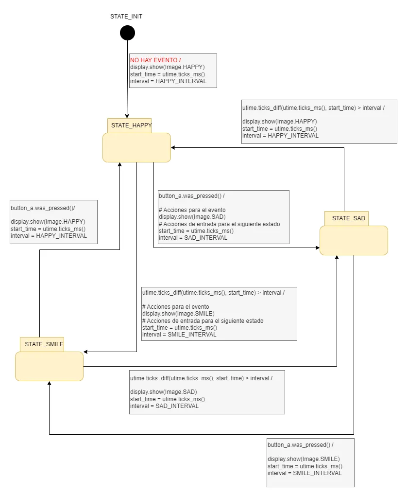

## Introducción 📜

En esta unidad vamos a profundizar un poco más en la programación del computador 
embebido o micro:bit. Vamos a estudiar una técnicas de programación 
basada en máquinas de estados que nos permitirá crear programas más complejos y
con mayor control sobre el flujo de ejecución. Esta técnica de programación 
no es exclusiva del micro:bit, sino que se utiliza en muchos otros lenguajes de
programación y plataformas, por lo que es una habilidad valiosa para cualquier 
ingeniero en diseño de entretenimiento digital. En la próxima unidad verás 
cómo podrás transferir esta técnica a otros lenguajes de programación y plataforma.

## Set: ¿Qué aprenderás en esta unidad? 💡

Vas a resolver problemas de programación en el micro:bit utilizando máquinas de estados.

### Actividad 01

#### Analizando un programa con una máquina de estados simple

Analicemos juntos el siguiente código identificando estados, eventos y acciones. Responde las preguntas planteadas.

``` py

from microbit import *
import utime

class Pixel:
    def __init__(self,pixelX,pixelY,initState,interval):
        self.state = "Init"
        self.startTime = 0
        self.interval = interval
        self.pixelX = pixelX
        self.pixelY = pixelY
        self.pixelState = initState

    def update(self):

        if self.state == "Init":
            self.startTime = utime.ticks_ms()
            self.state = "WaitTimeout"
            display.set_pixel(self.pixelX,self.pixelY,self.pixelState)

        elif self.state == "WaitTimeout":
            if utime.ticks_diff(utime.ticks_ms(),self.startTime) > self.interval:
                self.startTime = utime.ticks_ms()
                if self.pixelState == 9:
                    self.pixelState = 0
                else:
                    self.pixelState = 9
                display.set_pixel(self.pixelX,self.pixelY,self.pixelState)

pixel1 = Pixel(0,0,0,1000)
pixel2 = Pixel(4,4,0,500)

while True:
    pixel1.update()
    pixel2.update()

```

:::caution[📤 Bitácora] 
Escribe en tu bitácora lo siguiente:

1. Describe detalladamente cómo funciona este ejemplo.
2. ¿Cuáles son los estados en el programa? 
3. ¿Cuáles son los eventos/inputs en el programa?
4. ¿Cuáles son las acciones en el programa?
:::


### Actividad 02

#### Implementando un semáforo con máquina de estados

Implementemos juntos un semáforo simple (rojo, amarillo, verde) utilizando una máquina de estados en Micropython. Representaremos cada color del semáforo con un LED del display del micro:bit. 

:::caution[📤 Bitácora]
1. Escribe el código que soluciona este problema en tu bitácora.
2. Identifica los estados, eventos y acciones en tu código.
:::


## Seek: Investigación 🔎

### Actividad 03

#### Controlando la pantalla con una máquina de estados y concurrencia

Implementaremos juntos el siguiente programa que busca gestionar la concurrencia entre la secuencia de imágenes y la respuesta a la pulsación de botones.

Lee la siguiente descripción del problema y luego analiza la solución implementada. Para el análisis 
trata de observar estas preguntas:

- ¿Cómo es posible estructurar una aplicación usando una máquina de estados para poder atender varios eventos de manera concurrente?
- ¿Cómo haces para probar que el programa está correcto? 

**Descripción del problema**

Imagina un programa para el micro:bit que muestra diferentes expresiones en la pantalla según un ciclo de tiempo, pero que también reacciona de inmediato si presionas un botón. Al iniciar, se muestra una cara feliz durante un segundo y medio. Después, el micro:bit cambia a una expresión sonriente que dura un segundo. Luego, aparece una cara triste durante dos segundos, y el ciclo vuelve a comenzar.

Sin embargo, si en cualquier momento se presiona el botón A mientras la cara feliz o la sonriente están en pantalla, el micro:bit interrumpe el ciclo y muestra inmediatamente la cara triste o feliz, respectivamente. Si se presiona el botón A mientras la cara triste está en pantalla, el dispositivo cambia a la expresión sonriente. Así, el programa combina una secuencia visual predefinida con la capacidad de responder rápidamente a la interacción del usuario.

**Modelando del programa con una máquina de estados**



``` py
from microbit import *
import utime

STATE_INIT = 0
STATE_HAPPY = 1
STATE_SMILE = 2
STATE_SAD = 3

HAPPY_INTERVAL = 1500
SMILE_INTERVAL = 1000
SAD_INTERVAL = 2000

current_state = STATE_INIT
start_time = 0
interval = 0

while True:
    # pseudoestado STATE_INIT
    if current_state == STATE_INIT:
        display.show(Image.HAPPY)
        start_time = utime.ticks_ms()
        interval = HAPPY_INTERVAL
        current_state = STATE_HAPPY
    elif current_state == STATE_HAPPY:
        if button_a.was_pressed():
            # Acciones para el evento
            display.show(Image.SAD)
            # Acciones de entrada para el siguiente estado
            start_time = utime.ticks_ms()
            interval = SAD_INTERVAL
            current_state = STATE_SAD
        if utime.ticks_diff(utime.ticks_ms(), start_time) > interval:
            # Acciones para el evento
            display.show(Image.SMILE)
            # Acciones de entrada para el siguiente estado
            start_time = utime.ticks_ms()
            interval = SMILE_INTERVAL
            current_state = STATE_SMILE
    elif current_state == STATE_SMILE:
        if button_a.was_pressed():
            display.show(Image.HAPPY)
            start_time = utime.ticks_ms()
            interval = HAPPY_INTERVAL
            current_state = STATE_HAPPY
        if utime.ticks_diff(utime.ticks_ms(), start_time) > interval:
            display.show(Image.SAD)
            start_time = utime.ticks_ms()
            interval = SAD_INTERVAL
           current_state = STATE_SAD
    elif current_state == STATE_SAD:
        if button_a.was_pressed():
            display.show(Image.SMILE)
            start_time = utime.ticks_ms()
            interval = SMILE_INTERVAL
            current_state = STATE_SMILE
        if utime.ticks_diff(utime.ticks_ms(), start_time) > interval:
            display.show(Image.HAPPY)
            start_time = utime.ticks_ms()
            interval = HAPPY_INTERVAL
            current_state = STATE_HAPPY

```

:::caution[📤 Bitácora]
En tu bitácora:

1. Explica por qué decimos que este programa permite realizar de manera concurrente varias tareas.
2. Identifica los estados, eventos y acciones en el programa.
3. Describe y aplica al menos 3 vectores de prueba para el programa. Para definir un vector de prueba debes llevar al sistema a un estado, generar los eventos y observar el estado siguiente y las acciones que ocurrirán. Por tanto, un vector de prueba tiene unas condiciones iniciales del sistema, unos resultados esperados y los resultados realmente obtenidos. Si el resultado obtenido es igual al esperado entonces el sistema pasó el vector de prueba, de lo contrario el sistema puede tener un error.
:::


## Apply: Aplicación 🛠

### Actividad 04

#### Diseño de la lógica de una bomba temporizada

Diseña la máquina de estados para solucionar el siguiente problema:

En un escape room se requiere construir una aplicación para controlar una bomba temporizada. El circuito de control de la bomba está compuesto por cuatro sensores, denominados UP (botón A), DOWN (botón B), touch (botón de touch) y ARMED (el gesto de shake de acelerómetro). Tiene dos actuadores o dispositivos de salida que serán un display (la pantalla de LEDs) y un speaker.

**El controlador funciona así**:

Inicia en modo de configuración, es decir, sin hacer cuenta regresiva aún, la bomba está desarmada. El valor inicial del conteo regresivo es de 20 segundos.  

En el modo de configuración, los pulsadores UP y DOWN permiten aumentar o disminuir el tiempo inicial de la bomba.  

El tiempo se puede programar entre 10 y 60 segundos con cambios de 1 segundo. No olvides usar 
utime.ticks_ms() para medir el tiempo. Además, 1 segundo equivale a 1000 milisegundos.  

Hacer shake (ARMED) arma la bomba, es decir, inicia el conteo regresivo.  

Una vez armada la bomba, comienza la cuenta regresiva que será visualizada en la pantalla de LED

La bomba explotará (speaker) cuando el tiempo llegue a cero. 

Para volver a modo de configuración deberás tocar el botón touch.

:::caution[📤 Bitácora]
Construye un diagrama detallado de la máquina de estados, incluyendo 
estados, eventos, transiciones y acciones.
:::


### Actividad 05

#### Implementando la Bomba Temporizada

Implementa el código para la bomba temporizada usando mycropython y el micro:bit, incluyendo la funcionalidad básica: configuración del tiempo, cuenta regresiva y detonación.

:::caution[📤 Bitácora]
Reporta en un tu bitácora lo siguiente:
1. El código que implementa la bomba temporizada.
2. La definición de los vectores de prueba básicos que permiten verificar el 
correcto funcionamiento del programa.
:::


## Reflect: Consolidación y metacognición 🤔

### Actividad 06

#### Autoevaluación

**Mirando hacia adentro: autoevaluación de máquinas de estados y concurrencia**

El objetivo aquí es doble. Primero, que recuperes de tu memoria los conceptos de diseño y programación con máquinas de estados sin ayuda externa. Este esfuerzo por recordar (práctica de recuperación) es clave para un aprendizaje duradero. Segundo, que reflexiones sobre tu proceso de diseño y depuración, una habilidad esencial para cualquier ingeniero.

:::caution[📤 Bitácora]

En tu bitácora, sin consultar tu código, diagramas o notas, responde a las siguientes preguntas con tus propias palabras. Concéntrate en el esfuerzo de recordar, no en la perfección de la respuesta.

**Parte 1: recuperación de conocimiento (Retrieval Practice)**

1.  Describe con tus palabras qué es una máquina de estados. ¿Cuáles son sus cuatro componentes fundamentales que has utilizado en esta unidad?
2.  Explica por qué la técnica de máquina de estados es tan útil para gestionar la "concurrencia" (atender un temporizador y botones "al mismo tiempo") en un dispositivo con un solo hilo de ejecución como el micro:bit. ¿Qué problema soluciona en comparación con usar funciones como `sleep()`?
3.  Imagina que tienes que añadir una nueva funcionalidad a la bomba temporizada: si se agita (`shake`) el micro:bit *mientras* la cuenta regresiva está activa, el tiempo se reduce a la mitad. ¿Cómo modificarías tu diagrama de máquina de estados para incluir este nuevo evento y acción?
4.  Explica qué es un "vector de prueba" y por qué es una herramienta crucial para verificar que una máquina de estados funciona como se espera.

**Parte 2: reflexión sobre tu proceso (Metacognición)**

1.  ¿Qué parte del diseño de la bomba temporizada te resultó más desafiante: crear el diagrama de estados (Actividad 04) o traducir ese diagrama a código MicroPython (Actividad 05)? ¿Por qué?
2.  Describe un error o "bug" que encontraste al implementar tu programa. ¿Cómo te ayudó pensar en términos de estados, eventos y transiciones a identificar y solucionar el problema?
3.  El problema de la bomba era complejo. ¿Qué estrategia usaste para abordarlo? ¿Comenzaste con una versión simple y añadiste funcionalidades poco a poco?
4.  Ahora que entiendes el patrón de máquina de estados, ¿En qué otro tipo de proyecto o sistema de entretenimiento digital crees que podrías aplicarlo?
:::


### Actividad 07

#### Coevaluación

**Aprendiendo juntos: coevaluación constructiva**

Diseñar y programar es solo una parte del trabajo de un ingeniero; analizar y dar feedback sobre el trabajo de otros es igualmente importante. En esta actividad, revisarás el diseño y la implementación de la bomba temporizada de un compañero para ayudarle a mejorar y para ganar una nueva perspectiva.

:::caution[📤 Bitácora]

1.  Encuentra a un compañero de trabajo.
2.  Intercambien las URLs de sus bitácoras de aprendizaje.
3.  Revisa con atención las entradas de tu compañero para las Actividades 04 (diagrama de la bomba) y 05 (código y pruebas).
4.  Analiza de manera crítica el diseño y la implementación de tu compañero y deja un comentario de retroalimentación específico y constructivo.
5.  Conversa con tu compañero sobre su diseño y código, y discutan sus comentarios.
:::


### Actividad 08

#### Feedback

**Mejorando la experiencia: tu feedback es clave**

Mi objetivo es crear la mejor experiencia de aprendizaje posible, y tu perspectiva es esencial para lograrlo. Este es tu espacio para darme feedback honesto y directo sobre esta unidad, lo que me ayudará a refinarla para futuros estudiantes.

:::caution[📤 Bitácora]

Responde a las siguientes preguntas con total sinceridad. ¡Cada comentario es valioso!

1.  **Continuar**: ¿Qué actividad, explicación o ejemplo de esta unidad te ayudó más a entender el poder de las máquinas de estados? ¿Qué elemento consideras que es indispensable y debería mantener?
2.  **Dejar de hacer**: ¿Hubo algún paso o actividad que te pareció confuso, innecesariamente complicado o que aportó poco a tu aprendizaje? ¿Qué cambiarías o eliminarías?
3.  **Empezar a hacer**: ¿Qué te habría ayudado a entender mejor?
4.  **Ritmo y dificultad**: En una escala del 1 (muy fácil) al 5 (muy difícil), ¿Cómo calificarías la dificultad de pasar del análisis de un programa (Actividad 03) al diseño desde cero de uno complejo (Actividad 04 y 05)? ¿Por qué?
5.  **Comentario adicional**: ¿Hay algo más que te gustaría compartir sobre tu proceso de aprendizaje en esta unidad? ¿Algún momento de frustración o de "¡Aha!" que quieras destacar?
:::

