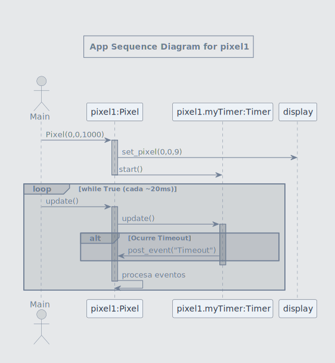
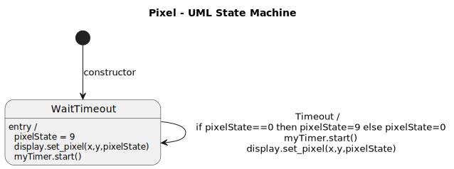
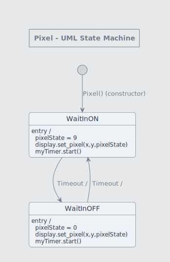
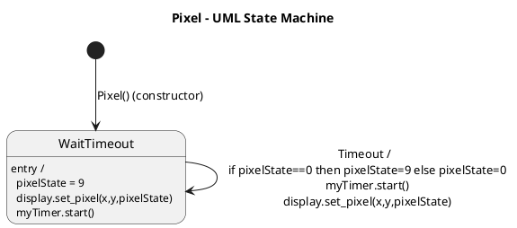
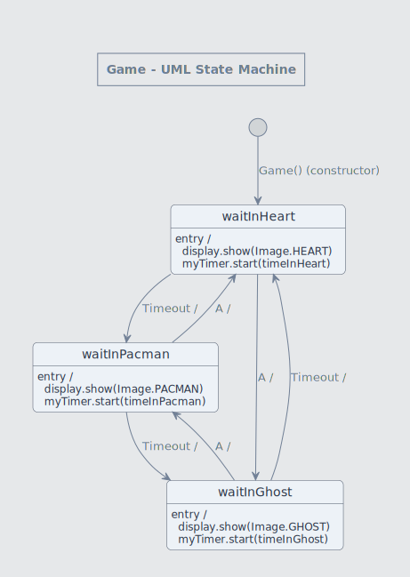
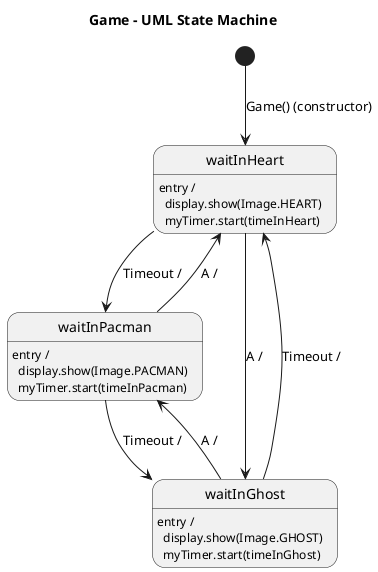

import { Aside } from '@astrojs/starlight/components';


## Introducción 📜

En esta unidad vamos a profundizar un poco más en la programación 
del computador embebido o micro:bit. Vamos a estudiar una técnica
de programación llamada máquinas de estados. Esta técnica te permitirá 
crear programas más complejos y con mayor control sobre el flujo 
de ejecución. Es importante que reconozcas que esta técnica de 
programación no es exclusiva del micro:bit, sino que se utiliza 
en muchos otros lenguajes de programación y plataformas, por lo 
que es una habilidad valiosa para cualquier ingeniero en diseño 
de entretenimiento digital. En la próxima unidad verás cómo podrás 
transferir esta técnica a otro lenguaje de programación y plataforma.

## Rúbrica de evaluación de la unidad 📝

:::note[Transparencia]
Esta rúbrica se socializa antes de la sustentación. La sustentación se 
basa en lo presentado en la aplicación y lo documentado en la bitácora. 
:::

### Requisito de salida (condición necesaria)

:::caution[Para poder cerrar la evaluación y registrar la nota]
La **bitácora de reflexión** debe estar diligenciada antes de terminar 
la sesión final y debe ser enseñada al profesor antes de abandonar el aula.
La presentación de la bitácora de reflexión es un requisito indispensable 
para montar la nota final en la plataforma académica. Si no se cumple este 
requisito, la nota final de la unidad será 0.0.
:::

---

### Rúbrica analítica

:::tip[Evidencias evaluadas]

1) Funcionamiento de la aplicación + documentación en bitácora.
2) Sustentación a partir de la app y la bitácora de aplicación.

:::

| Criterio (peso) | Cumple plenamente (5.0) | Se cumple medianamente (4.0)| Problemas importantes (3.0)| Falta comprensión básica (2.0) | No hay evidencia (0.0)
|---|---|---|---|---|---|
| **1. Aplicación + bitácora (40%)** | La app se ejecuta sin fallos en el entorno acordado. Evidencia completa y verificable en bitácora. Todo consistente con lo mostrado en la demo. | La app funciona y cumple lo esencial. La bitácora permite verificar, pero hay **1–2 vacíos menores**| La app funciona parcialmente o depende de condiciones no declaradas. Bitácora con **vacíos importantes** o incompleta. | La app no corre o no demuestra lo requerido. La bitácora no permite verificación de la app.| No se entregaron evidencias o no se puede acceder a ellas |
|Evaluación||||||
| **2. Sustentación (60%)** | Responde a las preguntas con precisión, conectando: **(a) lo que se ve**, **(b) cómo está hecho**, y **(c) por qué**. Usa su bitácora para justificar decisiones. Reconoce límites/errores y propone cómo probar/mejorar. | Respuestas correctas pero con **imprecisiones menores** o justificación superficial. Usa parcialmente la bitácora para sustentar. | Responde solo “qué hizo” pero le cuesta explicar “cómo” o “por qué”. Necesita guía para conectar con su propia evidencia/bitácora. | No logra responder de forma coherente o responde sin relación con lo presentado/documentado. Evidencia falta de comprensión básica del trabajo entregado. | No se entregaron evidencias o no se puede acceder a ellas |
|Evaluación||||||
---

:::tip[Cálculo de la nota]

$$
Nota = C_1*0.4  + C_2*0.6
$$

:::

---

## Set: ¿Qué aprenderás en esta unidad? 💡

Analizarás y aplicarás la técnica de máquinas de estados para el diseño 
y programación de aplicaciones interactivas. Recuerda que en esta 
unidad aplicarás lo aprendido al micro:bit, pero POR FAVOR no pierdas 
de vista que es una técnica de programación general que puedes aplicar
en muchos otros lenguajes y plataformas.

### Actividad 01

#### Analizando un programa con una máquina de estados simple

Analicemos juntos el siguiente código identificando estados, eventos y acciones. Esta aplicación controla dos pixeles del display del micro:bit 
que parpadean a diferentes velocidades. Para poder controlar el tiempo de parpadeo se utiliza una clase Timer que permite iniciar, detener y actualizar un temporizador. 
Nota que esta técnica de manejo del tiempo es diferente a la que vimos en la unidad anterior con sleep(). Ahora no es posible utilizar sleep() porque detendría 
toda la ejecución del programa y no podríamos manejar dos pixeles de manera concurrente. Te voy a mostrar dos diaframas primero para que puedas entender mejor la
estructura del programa y luego el código completo.



<details>
<summary>Fuente del diagrama anterior</summary>
```
@startuml

<style>
root {
  BackgroundColor #4a556822 
  FontColor #718096
  LineColor #718096
  Margin 30
  Padding 10
}

sequenceDiagram {
  participant {
    BackgroundColor #edf2f7
    LineColor #4a5568
    FontColor #2d3748
  }
  lifeLine {
    LineColor #718096
  }
  arrow {
    LineColor #718096
    FontColor #718096
  }
}
</style>

title App Sequence Diagram for pixel1

actor Main
participant "pixel1:Pixel" as P1
participant "pixel1.myTimer:Timer" as T1
participant "display" as D

Main -> P1 : Pixel(0,0,1000)
activate P1
P1 -> D : set_pixel(0,0,9)
P1 -> T1 : start()
deactivate P1


loop while True (cada ~20ms)
  Main -> P1 : update()
  activate P1
    P1 -> T1 : update()
    activate T1
      alt Ocurre Timeout
        T1 -> P1 : post_event("Timeout")
      end
    deactivate T1

    P1 -> P1: procesa eventos
    
  deactivate P1

end

@enduml

```

</details>



<details>
<summary>Fuente del diagrama anterior</summary>
```
@startuml

<style>
root {
  BackgroundColor #4a556822 
  FontColor #718096
  LineColor #718096
  Margin 30
  Padding 10
}

stateDiagram {
  state {
    BackgroundColor #edf2f7
    LineColor #4a5568
    FontColor #2d3748
    RoundCorner 10
  }
  arrow {
    LineColor #718096
    FontColor #718096
  }
}
</style>


title Pixel - UML State Machine

[*] --> WaitTimeout : Pixel() (constructor)
WaitTimeout : entry /\n  pixelState = 9\n  display.set_pixel(x,y,pixelState)\n  myTimer.start()
WaitTimeout : \n Timeout /\n  if pixelState==0 then pixelState=9 else pixelState=0\n  myTimer.start()\n  display.set_pixel(x,y,pixelState)

@enduml

```

</details>


``` py
from microbit import *
import utime

class Timer:
    def __init__(self, owner, event_to_post, duration):
        self.owner = owner
        self.event = event_to_post
        self.duration = duration
        
        self.start_time = 0
        self.active = False

    def start(self, new_duration=None):
        if new_duration is not None:
            self.duration = new_duration
        self.start_time = utime.ticks_ms()
        self.active = True

    def stop(self):
        self.active = False

    def update(self):
        if self.active:
            if utime.ticks_diff(utime.ticks_ms(), self.start_time) >= self.duration:
                self.active = False
                self.owner.post_event(self.event)


class Pixel:
    def __init__(self,_x,_y,_interval):
        self.event_queue = []
        self.timers = []
        self.x = _x
        self.y = _y
        self.pixelState = 0
        self.myTimer = self.createTimer("Timeout",_interval)

        self.estado_actual = None
        self.transicion_a(self.estado_waitTimeout)

    def createTimer(self,event,duration):
        t = Timer(self, event, duration)
        self.timers.append(t)
        return t

    def post_event(self, ev):
        self.event_queue.append(ev)

    def update(self):
        # 1. Actualizar todos los timers internos automáticamente
        for t in self.timers:
            t.update()
        
        # 2. Procesar la cola de eventos resultante
        while len(self.event_queue) > 0:
            ev = self.event_queue.pop(0)
            if self.estado_actual:
                self.estado_actual(ev)

    def transicion_a(self, nuevo_estado):
        if self.estado_actual: self.estado_actual("EXIT")
        self.estado_actual = nuevo_estado
        self.estado_actual("ENTRY")

    def estado_waitTimeout(self, ev):
        if ev == "ENTRY":
            self.pixelState = 9
            display.set_pixel(self.x,self.y,self.pixelState)
            self.myTimer.start()
        elif ev == "Timeout":
            if self.pixelState == 0:
                self.pixelState = 9
                self.myTimer.start()
            else: 
                self.pixelState = 0
                self.myTimer.start()
            
            display.set_pixel(self.x,self.y,self.pixelState)

pixel1 = Pixel(0,0,1000)
pixel2 = Pixel(4,4,600)

while True:
    pixel1.update()
    pixel2.update()
    utime.sleep_ms(20)
```

Otra manera de modelar la solución del problema es esta:



<details>
<summary>Fuente del diagrama anterior</summary>

```
@startuml

<style>
root {
  BackgroundColor #4a556822 
  FontColor #718096
  LineColor #718096
  Margin 30
  Padding 10
}

stateDiagram {
  state {
    BackgroundColor #edf2f7
    LineColor #4a5568
    FontColor #2d3748
    RoundCorner 10
  }
  arrow {
    LineColor #718096
    FontColor #718096
  }
}
</style>


title Pixel - UML State Machine

[*] --> WaitInON : Pixel() (constructor)
WaitInON : entry /\n  pixelState = 9\n  display.set_pixel(x,y,pixelState)\n  myTimer.start()
WaitInON --> WaitInOFF : \n Timeout /
WaitInOFF: entry /\n  pixelState = 0\n  display.set_pixel(x,y,pixelState)\n  myTimer.start()
WaitInOFF --> WaitInON : \n Timeout /

@enduml
```
</details>


```py
from microbit import *
import utime

class Timer:
    def __init__(self, owner, event_to_post, duration):
        self.owner = owner
        self.event = event_to_post
        self.duration = duration

        self.start_time = 0
        self.active = False

    def start(self, new_duration=None):
        if new_duration is not None:
            self.duration = new_duration
        self.start_time = utime.ticks_ms()
        self.active = True

    def stop(self):
        self.active = False

    def update(self):
        if self.active:
            if utime.ticks_diff(utime.ticks_ms(), self.start_time) >= self.duration:
                self.active = False
                self.owner.post_event(self.event)


class Pixel:
    def __init__(self,_x,_y,_interval):
        self.event_queue = []
        self.timers = []
        self.x = _x
        self.y = _y
        self.pixelState = 0
        self.myTimer = self.createTimer("Timeout",_interval)

        self.estado_actual = None
        self.transicion_a(self.estado_waitInON)

    def createTimer(self,event,duration):
        t = Timer(self, event, duration)
        self.timers.append(t)
        return t

    def post_event(self, ev):
        self.event_queue.append(ev)

    def update(self):
        # 1. Actualizar todos los timers internos automáticamente
        for t in self.timers:
            t.update()

        # 2. Procesar la cola de eventos resultante
        while len(self.event_queue) > 0:
            ev = self.event_queue.pop(0)
            if self.estado_actual:
                self.estado_actual(ev)

    def transicion_a(self, nuevo_estado):
        if self.estado_actual: self.estado_actual("EXIT")
        self.estado_actual = nuevo_estado
        self.estado_actual("ENTRY")

    def estado_waitInON(self, ev):
        if ev == "ENTRY":
            self.pixelState = 9
            display.set_pixel(self.x,self.y,self.pixelState)
            self.myTimer.start()
        elif ev == "Timeout":
            self.transicion_a(self.estado_waitInOFF)

    def estado_waitInOFF(self, ev):
        if ev == "ENTRY":
            self.pixelState = 0
            display.set_pixel(self.x,self.y,self.pixelState)
            self.myTimer.start()
        elif ev == "Timeout":
            self.transicion_a(self.estado_waitInON)

pixel1 = Pixel(0,0,1000)
pixel2 = Pixel(4,4,600)

while True:
    pixel1.update()
    pixel2.update()
    utime.sleep_ms(20)
```


:::caution[📤 Bitácora] 
Escribe en tu bitácora lo siguiente:

1. ¿Cuáles son los estados en el programa? 
2. ¿Cuáles son los eventos en el programa?
3. ¿Cuáles son las acciones en el programa?
:::

## Seek: Investigación 🔎

### Actividad 02

#### Implementando un semáforo con máquinas de estados

Implementemos juntos un semáforo simple utilizando una máquina de 
estados en Micropython. Representaremos cada color del semáforo con 
un LED del display del micro:bit. La secuencia de cambio del semáforo 
será 2 segundos en rojo --> 1 segundo en verde --> 0.5 segundos en amarillo 
--> regresa a rojo --> repite el ciclo.


```py
from microbit import *
import utime

class Timer:
    def __init__(self, owner, event_to_post, duration):
        self.owner = owner
        self.event = event_to_post
        self.duration = duration
        
        self.start_time = 0
        self.active = False

    def start(self, new_duration=None):
        if new_duration is not None:
            self.duration = new_duration
        self.start_time = utime.ticks_ms()
        self.active = True

    def stop(self):
        self.active = False

    def update(self):
        if self.active:
            if utime.ticks_diff(utime.ticks_ms(), self.start_time) >= self.duration:
                self.active = False
                self.owner.post_event(self.event)


class Semaforo:
    def __init__(self,_x,_y,_timeInRed,_timeInGreen,_timeInYellow):
        self.event_queue = []
        self.timers = []
        self.x = _x
        self.y = _y
        self.timeInRed = _timeInRed
        self.timeInGreen = _timeInGreen
        self.timeInYellow = _timeInYellow
        self.myTimer = self.createTimer("Timeout",self.timeInRed)

        self.estado_actual = None
        self.transicion_a(self.estado_waitInRed)

    def createTimer(self,event,duration):
        t = Timer(self, event, duration)
        self.timers.append(t)
        return t

    def post_event(self, ev):
        self.event_queue.append(ev)

    def update(self):
        # 1. Actualizar todos los timers internos automáticamente
        for t in self.timers:
            t.update()
        
        # 2. Procesar la cola de eventos resultante
        while len(self.event_queue) > 0:
            ev = self.event_queue.pop(0)
            if self.estado_actual:
                self.estado_actual(ev)

    def transicion_a(self, nuevo_estado):
        if self.estado_actual: self.estado_actual("EXIT")
        self.estado_actual = nuevo_estado
        self.estado_actual("ENTRY")

    def clear(self):
        display.set_pixel(self.x,self.y,0)
        display.set_pixel(self.x,self.y+1,0)
        display.set_pixel(self.x,self.y+2,0)

    def estado_waitInRed(self, ev):
        if ev == "ENTRY":
            self.clear()
            display.set_pixel(self.x,self.y,9)
            self.myTimer.start(self.timeInRed)
        if ev == "Timeout":
            display.set_pixel(self.x,self.y,0)
            self.transicion_a(self.estado_waitInGreen)

    def estado_waitInGreen(self, ev):
        if ev == "ENTRY":
            self.clear()
            display.set_pixel(self.x,self.y+2,9)
            self.myTimer.start(self.timeInGreen)
            
        if ev == "Timeout":
            display.set_pixel(self.x,self.y+2,0)
            self.transicion_a(self.estado_waitInYellow)

        if ev == "A":
            display.set_pixel(self.x,self.y+2,0)
            self.transicion_a(self.estado_waitInYellow)

    def estado_waitInYellow(self, ev):
        if ev == "ENTRY":
            self.clear()
            display.set_pixel(self.x,self.y+1,9)
            self.myTimer.start(self.timeInYellow)
        if ev == "Timeout":
            display.set_pixel(self.x,self.y+1,0)
            self.transicion_a(self.estado_waitInRed)

semaforo1 = Semaforo(0,0,2000,1000,500)

while True:
    semaforo1.update()
    utime.sleep_ms(20)

```

Antes de continuar con las actividades propuestas para esta actividad, voy a mostrarte 
cómo implementé en plantUML la máquina de estados del caso anterior. Esto te servirá 
de guía para que puedas construir la máquina de estados de esta actividad. Pega 
el siguiente código en el editor de plantUML que puedes encontrar 
[aquí](https://editor.plantuml.com/).




:::caution[📤 Bitácora]
1. Vas a realizar una modificación. Cuando el semáforo esté en verde, 
   si se presiona el botón A, el semáforo debe cambiar inmediatamente 
   a amarillo (sin esperar a que termine el tiempo de verde). El evento 
   que se debe postear es "A" (post_event("A")).
2. Construye la máquina de estados que modela el problema usando [PlantUML](https://plantuml.com/). 
Puedes encontrar el editor [aquí](https://editor.plantuml.com/) y la documentación básica con 
ejemplos [aquí](https://plantuml.com/state-diagram).
:::

### Actividad 03

#### Máquina de estados con botones

Implementaremos juntos el siguiente programa que busca gestionar la concurrencia 
entre la secuencia de imágenes y la respuesta a la pulsación de botones.

Lee la siguiente descripción del problema y luego analiza la solución 
implementada. Para el análisis trata de observar estas preguntas:

* ¿Cómo es posible estructurar una aplicación usando una máquina de estados 
para poder atender varios eventos de manera concurrente?

* ¿Cómo haces para probar que el programa está correcto?

**Descripción del problema**

Imagina un programa para el micro:bit que muestra diferentes imágenes y que también 
**reacciona de inmediato** si presionas un botón. Al iniciar, se muestra un 
corazón durante un segundo y medio. Después, el micro:bit cambia a 
un pacman que dura un segundo. Luego, aparece un ghost durante dos 
segundos, y el ciclo vuelve a comenzar.

Sin embargo, si en cualquier momento se presiona el botón A mientras está el corazón 
saltará inmediatamente al ghost. Si se presiona el botón A mientras está el pacman, 
saltará al corazón. Si se presiona el botón A mientras está el ghost, se mostrará el pacman.



<details>
<summary>Fuente del diagrama anterior</summary>


</details>


```py 
from microbit import *
import utime

class Timer:
    def __init__(self, owner, event_to_post, duration):
        self.owner = owner
        self.event = event_to_post
        self.duration = duration
        self.start_time = 0
        self.active = False

    def start(self, new_duration=None):
        if new_duration is not None:
            self.duration = new_duration
        self.start_time = utime.ticks_ms()
        self.active = True

    def stop(self):
        self.active = False

    def update(self):
        if self.active:
            if utime.ticks_diff(utime.ticks_ms(), self.start_time) >= self.duration:
                self.active = False
                self.owner.post_event(self.event)


class Game:
    def __init__(self):
        self.event_queue = []
        self.timers = []
        self.timeInHeart = 2500
        self.timeInPacman = 1000
        self.timeInGhost = 2000
        self.myTimer = self.createTimer("Timeout",self.timeInHeart)

        self.estado_actual = None
        self.transicion_a(self.estado_waitInHeart)

    def createTimer(self,event,duration):
        t = Timer(self, event, duration)
        self.timers.append(t)
        return t

    def post_event(self, ev):
        self.event_queue.append(ev)

    def update(self):
        # 1. Actualizar todos los timers internos automáticamente
        for t in self.timers:
            t.update()
        
        # 2. Procesar la cola de eventos resultante
        while len(self.event_queue) > 0:
            ev = self.event_queue.pop(0)
            if self.estado_actual:
                self.estado_actual(ev)

    def transicion_a(self, nuevo_estado):
        if self.estado_actual: self.estado_actual("EXIT")
        self.estado_actual = nuevo_estado
        self.estado_actual("ENTRY")


    def estado_waitInHeart(self, ev):
        if ev == "ENTRY":
            display.show(Image.HEART)
            self.myTimer.start(self.timeInHeart)
        if ev == "Timeout":
            self.transicion_a(self.estado_waitInPacman)
        if ev == "A":
            self.transicion_a(self.estado_waitInGhost)


    def estado_waitInPacman(self, ev):
        if ev == "ENTRY":
            display.show(Image.PACMAN)
            self.myTimer.start(self.timeInPacman)
        if ev == "Timeout":
            self.transicion_a(self.estado_waitInGhost)
        if ev == "A":
            self.transicion_a(self.estado_waitInHeart)     

    def estado_waitInGhost(self, ev):
        if ev == "ENTRY":
            display.show(Image.GHOST)
            self.myTimer.start(self.timeInGhost)
        if ev == "Timeout":
            self.transicion_a(self.estado_waitInHeart)
        if ev == "A":
            self.transicion_a(self.estado_waitInPacman) 
        
game = Game()

while True:
    if button_a.was_pressed(): 
        game.post_event("A")
    game.update()
    utime.sleep_ms(20)

```


:::caution[📤 Bitácora]
Vamos a tomarnos un momento para revisar de manera individual el código y 
la máquina de estados modelada. ¿Hay algo que aún no comprendes completamente?
:::

## Apply: Aplicación 🛠

### Actividad 04

#### Temporizador interactivo con máquina de estados

:::caution[Importante]
La solución a este problema TIENE algunas restricciones importantes. 
Si no cumples con estas restricciones, aunque tu aplicación funcione 
correctamente, el criterio C1 de la rúbrica analítica será calificado 
con 0.0.

* Debes utilizar la misma arquitectura de máquina de estados que
hemos venido trabajando en las actividades anteriores. 
* Debes usar la clase Timer para gestionar el tiempo.
* Debes emplear la función make_fill_images() para crear las imágenes
del display y la función display.show(FILL[n]) para mostrarlas.
* Debes usar los eventos "A", "B" y "S" para los botones y el gesto 
de shake respectivamente.
* NO PUEDES usar sleep() en la implementación de la máquina de estados. Recuerda 
usar Timer para gestionar los tiempos.
:::

En un escape room se requiere construir una aplicación para controlar una temporizador. 
El circuito de control de este está compuesto por tres sensores, denominados 
UP (botón A), DOWN (botón B) y ARMED (el gesto de shake de acelerómetro). 
Tiene dos actuadores o dispositivos de salida que serán un display (la pantalla de LEDs) y 
un speaker.

**El controlador funciona así:**

1. Inicia en modo de configuración, es decir, sin hacer cuenta regresiva aún, 
el temporizador está desarmado. El valor inicial del conteo regresivo es de 20 pixeles comenzando 
desde la parte superior izquierda del display y avanzando fila por fila hasta la parte inferior derecha.
Cada pixel representa 1 segundo.

2. En el modo de configuración, los pulsadores A y B permiten aumentar o disminuir 
la cantidad de pixeles que contará el temporizador. 

3. El tiempo se puede programar entre 15 y 25 pixeles. 

4. Es obligatorio usar la clase Timer para gestionar el tiempo. No olvides que los tiempos 
están en milisegundos, es decir, 1 segundo equivale a 1000 milisegundos.

5. Hacer shake (ARMED) arma el temporizador, es decir, inicia el conteo regresivo.

6. Una vez armado el temporizador, comienza la cuenta regresiva que será visualizada 
en la pantalla de LED apagando un pixel cada segundo y comenzando desde el pixel 
de la parte inferior hasta el pixel de la parte superior izquierda.

7. Una vez el temporizador termine se debe mostrar en el display una calavera y
sonar el speaker. Para volver a modo de configuración se debe presionar el botón A y 
el temporizador se reinicia a 20 pixeles quedando desarmado y listo para una nueva configuración.

8. Al generar los eventos de los botones y el gesto de shake, recuerda usar
el método post_event("EVENTO") para enviar los eventos a la máquina de estados. Los 
eventos será "A", "B" y "S" respectivamente.

Te dejo el código base para que puedas iniciar tu desarrollo:

**Función para crear las imágenes de llenado del display:**

```py
def make_fill_images(on='9', off='0'):
    imgs = []
    for n in range(26): 
        rows = []
        k = 0
        for y in range(5):
            row = []
            for x in range(5):
                row.append(on if k < n else off)
                k += 1
            rows.append(''.join(row))
        imgs.append(Image(':'.join(rows)))
    return imgs

FILL = make_fill_images()
# Para mostrar usas display.show(FILL[n]) donde n será
# un valor de 0 a 25
```

**Timer:**

```py
class Timer:
    def __init__(self, owner, event_to_post, duration):
        self.owner = owner
        self.event = event_to_post
        self.duration = duration
        self.start_time = 0
        self.active = False

    def start(self, new_duration=None):
        if new_duration is not None:
            self.duration = new_duration
        self.start_time = utime.ticks_ms()
        self.active = True

    def stop(self):
        self.active = False

    def update(self):
        if self.active:
            if utime.ticks_diff(utime.ticks_ms(), self.start_time) >= self.duration:
                self.active = False
                self.owner.post_event(self.event)
```

**Estructura básica de una tarea con máquina de estados:**

```py
class Task:
    def __init__(self):
        self.event_queue = []
        self.timers = []
        # Personalizas el nombre del evento y la duración
        self.myTimer = self.createTimer("Timeout",1000) 

        self.estado_actual = None
        self.transicion_a(self.estado_estado1)

    def createTimer(self,event,duration):
        t = Timer(self, event, duration)
        self.timers.append(t)
        return t

    def post_event(self, ev):
        self.event_queue.append(ev)

    def update(self):
        # 1. Actualizar todos los timers internos automáticamente
        for t in self.timers:
            t.update()
        
        # 2. Procesar la cola de eventos resultante
        while len(self.event_queue) > 0:
            ev = self.event_queue.pop(0)
            if self.estado_actual:
                self.estado_actual(ev)

    def transicion_a(self, nuevo_estado):
        if self.estado_actual: self.estado_actual("EXIT")
        self.estado_actual = nuevo_estado
        self.estado_actual("ENTRY")


    def estado_estado1(self, ev):
        if ev == "ENTRY":
            pass
        if ev == "Timeout":
            pass

    def estado_estado2(self, ev):
        if ev == "ENTRY":
            pass
        if ev == "Timeout":
            pass
```

**El ciclo principal:**

```py
task = Task()
while True:
    # Aquí generas los eventos de los botones y el gesto
    if button_a.was_pressed(): 
        task.post_event("A")
    if button_b.was_pressed(): 
        task.post_event("B")
    if accelerometer.was_gesture("shake"):
        task.post_event("S")
        
    task.update()
    utime.sleep_ms(20)
```

:::caution[📤 Bitácora]
1. Construye la máquina de estados que modela el problema usando [PlantUML](https://plantuml.com/). 
Puedes encontrar el editor [aquí](https://editor.plantuml.com/) y la documentación básica con 
ejemplos [aquí](https://plantuml.com/state-diagram).
2. Implementa el código en Micropython y colócalo en tu bitácora. Recuerda que puedes 
usar el simulador de micro:bit en [este enlace](https://python.microbit.org/v/3).
:::

## Reflect: Consolidación y metacognición 🤔

### Actividad 05

Esta actividad es un reto final. La idea es modificar el temporizador
interactivo de modo que puedas controlarlo también desde p5.js además 
de los botones del micro:bit. Usa las letras A, B y S para simular los 
botones UP, DOWN y ARMED respectivamente. Además, recuerda que en la unidad 
1 Actividad 03 ya tienes la receta para recibir mensajes desde p5.js al micro:bit. 
Ten presente que NO DEBES CAMBIAR la arquitectura de la aplicación. La idea es que 
puedas extenderla añadiendo la funcionalidad de p5.js sin cambiar la estructura
de máquina de estados que ya tienes.

:::caution[📤 Bitácora]
1. Explica cómo resolviste el reto.
2. Coloca el código final en tu bitácora tanto para el micro:bit 
   como para p5.js.
:::