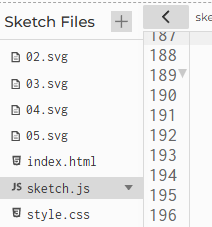

import { Aside } from '@astrojs/starlight/components';

## Introducción 📜

En esta unidad vas a explorar un nuevo tipo de protocolo de comunicación serial, el protocolo binario. Este 
protocolo es más eficiente que el ASCII, ya que permite enviar mas información en menos tiempo. Sin embargo, es más 
complejo de implementar y requiere un mayor conocimiento de la programación de bajo nivel. Por tanto, te voy a 
proponer que continuemos con la misma aplicación que exploramos en la unidad anterior, pero ahora la vamos a 
modificar para que use el protocolo binario. De esta manera podrás comparar los dos protocolos y ver 
las ventajas y desventajas de cada uno.

## Set: ¿Qué aprenderás en esta unidad? 💡

Vas a enviar información desde el micro:bit a un sketch en p5.js usando protocolos de comunicación binarios. 
Además, vas a comparar los protocolos ASCII y binario y verás las ventajas y desventajas de cada uno.


## Rúbrica de evaluación de la unidad 📝

Esta rúbrica evalúa tu proceso en toda la unidad desde la actividad 1 hasta la actividad 4. La 
actividad 5 es una actividad de autoevaluación y no se evalúa de manera sumativa.

<Aside type="note" title="RUBRICA!">

Esta rúbrica está diseñada para evaluar tu proceso de exploración, experimentación y aprendizaje al trabajar con protocolos de 
comunicación binarios, tal como se documenta en tu bitácora de aprendizaje, abarcando desde la Actividad 01 hasta la Actividad 04. 
El foco no está en el resultado final perfecto de la aplicación, sino en la profundidad de tu investigación, la calidad de tus 
experimentos para entender los mecanismos subyacentes y tu capacidad para reflexionar y articular lo que has aprendido.

| Criterio | **Inicial (0.0 - 1.9)** | **En desarrollo (2.0 - 3.4)** | **Logrado (3.5 - 4.4)** | **Excelente (4.5 - 5.0)** |
| :--- | :--- | :--- | :--- | :--- |
| **1. Profundidad de la Indagación** | Las preguntas formuladas (o la falta de ellas) son superficiales y la exploración se limita a seguir las instrucciones sin cuestionar el "porqué" de las soluciones. | Se formulan preguntas relevantes, pero se enfocan principalmente en el "cómo" funcionan las partes del código (ej. "¿Cómo usar `struct.pack`?"). La indagación se centra en resolver problemas técnicos inmediatos. | Se formulan preguntas que **comparan y contrastan** los protocolos (ej. "¿Cuántos bytes ahorro realmente con el protocolo binario en mi caso específico?"). Se investiga la causa raíz de los errores (ej. "¿Por qué ocurre el error de sincronización?"). | Se formulan preguntas que exploran el **diseño y sus implicaciones** (ej. "¿Qué otras estrategias de *framing* existen y cuáles son sus ventajas?" o "¿En qué escenarios un protocolo ASCII podría ser preferible a uno binario, a pesar de su ineficiencia?"). La indagación demuestra una curiosidad por los principios de la comunicación de datos. |
| **2. Calidad de la Experimentación** | Los experimentos se limitan a la simple ejecución del código proporcionado o de las modificaciones indicadas, sin un análisis sistemático. | Se realizan los experimentos guiados y se utiliza la terminal serial o la consola de p5.js para observar los datos, pero sin un análisis profundo de lo observado. | Se diseñan y ejecutan experimentos **deliberados y efectivos** para verificar hipótesis o el funcionamiento de componentes específicos (ej. enviar valores conocidos para validar la lectura, provocar un error de *checksum* para verificar su manejo). | Se diseñan experimentos **precisos y creativos** que no solo verifican, sino que **aíslan y demuestran** la necesidad de ciertas soluciones o las sutilezas de la comunicación. Por ejemplo, se diseña un caso de prueba para reproducir de forma consistente el error de sincronización *antes* de implementar la solución de *framing*. |
| **3. Análisis y Reflexión** | La bitácora es un registro de acciones sin análisis. Se describe lo que se ve (ej. "salen caracteres raros en la terminal") pero no se explica la causa. Las conclusiones son incorrectas o no están respaldadas por evidencia. | La bitácora describe los resultados, pero la reflexión es superficial. Se identifica el problema (ej. "los datos llegan mal") pero no se articula claramente por qué una solución (como el *framing*) lo resuelve a nivel de bytes. | La bitácora **conecta claramente la evidencia** (capturas de la terminal, logs de la consola, depurador) con la explicación teórica. Se analiza por qué un protocolo sin *framing* es frágil y cómo la combinación de *header* y *checksum* aporta robustez. Se analizan los errores como parte del aprendizaje. | La bitácora demuestra una **reflexión profunda** que va más allá de la simple verificación. Se analiza el *trade-off* entre eficiencia de transmisión y complejidad de implementación, y se construye un **modelo mental robusto** del flujo de datos, desde el microcontrolador hasta la aplicación de p5.js. |
| **4. Apropiación y Articulación de Conceptos** | La bitácora muestra una definición incorrecta o copiada de los conceptos (ej. *framing*, *checksum*, *DataView*). No hay evidencia de comprensión personal. | La bitácora explica los conceptos de forma básica. Se entiende que el protocolo binario "es más rápido", pero no se puede explicar por qué en términos de representación de datos o flujo de bytes. | La bitácora demuestra una **comprensión clara y correcta** de cada componente del protocolo. Se explica con palabras propias la función del *header*, del *checksum*, del `DataView` en JavaScript y del empaquetado con `struct` en MicroPython. | La bitácora demuestra una **maestría conceptual**. Se explican los conceptos como un **sistema interdependiente**. Se articula con total claridad y usando analogías propias por qué la comunicación serial es un flujo de bytes asíncrono y cómo un protocolo impone orden sobre ese "caos" para garantizar una comunicación fiable y eficiente. |

</Aside>

<Aside type="caution" title="Valoración de la unidad">

1. En la bitácora vas proponer una nota o valoración para esta unidad según la rúbrica. 
Además, deberás justificar tu valoración para cada criterio de la rúbrica, señalando claramente 
las evidencias que has aportado en tu bitácora.

En la última sesión de la semana 2 de la unidad realizarás la evaluación sumativa con el 
profesor mediante una una conversación corta de máximo 4 minutos.

2. Si no tienes realizado el ejercicio de valoración de la unidad, no podrás 
tener la conversación con el profesor y por tanto tu nota temporal será 0. En ese 
caso habla con el profesor para acordar el plan de acción a seguir.

</Aside>

### Actividad 01

#### Repasa el caso de estudio 

En esta actividad vas a poner a funcionar el caso de estudio de la unidad anterior y 
lo vas a repasar de nuevo. Mira, es muy importante que le dedique un tiempo generoso a revisar de nuevo 
el caso de estudio, ya que es un ejemplo muy completo y te va a ayudar a entender mejor el resto de la unidad.

El [código del micro:bit](https://python.microbit.org/v/3) es este:

``` py
# Imports go at the top
from microbit import *

uart.init(115200)
display.set_pixel(0,0,9)

while True:
    xValue = accelerometer.get_x()
    yValue = accelerometer.get_y()
    aState = button_a.is_pressed()
    bState = button_b.is_pressed()
    data = "{},{},{},{}\n".format(xValue, yValue, aState,bState)
    uart.write(data)
    sleep(100) # Envia datos a 10 Hz
```

El código del [sketch](https://editor.p5js.org/) es este:

**index.html**:

``` js
<!DOCTYPE html>
<html>
  <head>
    <script src="https://cdn.jsdelivr.net/npm/p5@1.11.10/lib/p5.js"></script>
    <script src="https://cdn.jsdelivr.net/npm/p5.sound@0.2.0/dist/p5.sound.min.js"></script>
    <script src="https://unpkg.com/@gohai/p5.webserial@^1/libraries/p5.webserial.js"></script>
    <link rel="stylesheet" type="text/css" href="style.css">
  </head>
  <body>
    <script src="sketch.js"></script>
  </body>
</html>
```

Carga las imágenes:



**sketch.js**:

``` js
let c;
let lineModuleSize = 0;
let angle = 0;
let angleSpeed = 1;
const lineModule = [];
let lineModuleIndex = 0;
let clickPosX = 0;
let clickPosY = 0;

function preload() {
  lineModule[1] = loadImage("02.svg");
  lineModule[2] = loadImage("03.svg");
  lineModule[3] = loadImage("04.svg");
  lineModule[4] = loadImage("05.svg");
}

let port;
let connectBtn;
let connectionInitialized = false;
let microBitConnected = false;

const STATES = {
  WAIT_MICROBIT_CONNECTION: "WAITMICROBIT_CONNECTION",
  RUNNING: "RUNNING",
};
let appState = STATES.WAIT_MICROBIT_CONNECTION;
let microBitX = 0;
let microBitY = 0;
let microBitAState = false;
let microBitBState = false;
let prevmicroBitAState = false;
let prevmicroBitBState = false;

function setup() {
  createCanvas(windowWidth, windowHeight);
  background(255);

  port = createSerial();
  connectBtn = createButton("Connect to micro:bit");
  connectBtn.position(0, 0);
  connectBtn.mousePressed(connectBtnClick);
}

function connectBtnClick() {
  if (!port.opened()) {
    port.open("MicroPython", 115200);
    connectionInitialized = false;
  } else {
    port.close();
  }
}

function updateButtonStates(newAState, newBState) {
  // Generar eventos de keypressed
  if (newAState === true && prevmicroBitAState === false) {
    // create a new random color and line length
    lineModuleSize = random(50, 160);
    // remember click position
    clickPosX = microBitX;
    clickPosY = microBitY;
    print("A pressed");
  }
  // Generar eventos de key released
  if (newBState === false && prevmicroBitBState === true) {
    c = color(random(255), random(255), random(255), random(80, 100));
    print("B released");
  }

  prevmicroBitAState = newAState;
  prevmicroBitBState = newBState;
}

function windowResized() {
  resizeCanvas(windowWidth, windowHeight);
}

function draw() {
  //******************************************
  if (!port.opened()) {
    connectBtn.html("Connect to micro:bit");
    microBitConnected = false;
  } else {
    microBitConnected = true;
    connectBtn.html("Disconnect");

    if (port.opened() && !connectionInitialized) {
      port.clear();
      connectionInitialized = true;
    }

    if (port.availableBytes() > 0) {
      let data = port.readUntil("\n");
      if (data) {
        data = data.trim();
        let values = data.split(",");
        if (values.length == 4) {
          microBitX = int(values[0]) + windowWidth / 2;
          microBitY = int(values[1]) + windowHeight / 2;
          microBitAState = values[2].toLowerCase() === "true";
          microBitBState = values[3].toLowerCase() === "true";
          updateButtonStates(microBitAState, microBitBState);
        } else {
          print("No se están recibiendo 4 datos del micro:bit");
        }
      }
    }
  }
  //*******************************************

  switch (appState) {
    case STATES.WAIT_MICROBIT_CONNECTION:
      // No puede comenzar a dibujar hasta que no se conecte el microbit
      // evento 1:
      if (microBitConnected === true) {
        // Preparo todo para el estado en el próximo frame
        print("Microbit ready to draw");
        strokeWeight(0.75);
        c = color(181, 157, 0);
        noCursor();
        appState = STATES.RUNNING;
      }

      break;

    case STATES.RUNNING:
      // EVENTO: estado de conexión del microbit
      if (microBitConnected === false) {
        print("Waiting microbit connection");
        cursor();
        appState = STATES.WAIT_MICROBIT_CONNECTION;
      }

      //EVENTO: recepción de datos seriales del micro:bit

      if (microBitAState === true) {
        let x = microBitX;
        let y = microBitY;

        if (keyIsPressed && keyCode === SHIFT) {
          if (abs(clickPosX - x) > abs(clickPosY - y)) {
            y = clickPosY;
          } else {
            x = clickPosX;
          }
        }

        push();
        translate(x, y);
        rotate(radians(angle));
        if (lineModuleIndex != 0) {
          tint(c);
          image(
            lineModule[lineModuleIndex],
            0,
            0,
            lineModuleSize,
            lineModuleSize
          );
        } else {
          stroke(c);
          line(0, 0, lineModuleSize, lineModuleSize);
        }
        angle += angleSpeed;
        pop();
      }

      break;
  }
}

function keyPressed() {
  if (keyCode == UP_ARROW) lineModuleSize += 5;
  if (keyCode == DOWN_ARROW) lineModuleSize -= 5;
  if (keyCode == LEFT_ARROW) angleSpeed -= 0.5;
  if (keyCode == RIGHT_ARROW) angleSpeed += 0.5;
}

function keyReleased() {
  if (key == "s" || key == "S") {
    let ts =
      year() +
      nf(month(), 2) +
      nf(day(), 2) +
      "_" +
      nf(hour(), 2) +
      nf(minute(), 2) +
      nf(second(), 2);
    saveCanvas(ts, "png");
  }
  if (keyCode == DELETE || keyCode == BACKSPACE) background(255);

  // reverse direction and mirror angle
  if (key == "d" || key == "D") {
    angle += 180;
    angleSpeed *= -1;
  }

  // default colors from 1 to 4
  if (key == "1") c = color(181, 157, 0);
  if (key == "2") c = color(0, 130, 164);
  if (key == "3") c = color(87, 35, 129);
  if (key == "4") c = color(197, 0, 123);

  // load svg for line module
  if (key == "5") lineModuleIndex = 0;
  if (key == "6") lineModuleIndex = 1;
  if (key == "7") lineModuleIndex = 2;
  if (key == "8") lineModuleIndex = 3;
  if (key == "9") lineModuleIndex = 4;
}

```

En tu bitácora de aprendizaje puedes abordar estas preguntas:

- Describe cómo se están comunicando el micro:bit y el sketch de p5.js. 
¿Qué datos envía el micro:bit?
- ¿Cómo es la estructura del protocolo ASCII usado?
- Muestra y explica la parte del código de p5.js donde lee los datos del micro:bit y los 
transforma en coordenadas de la pantalla.
- ¿Cómo se generan los eventos A pressed y B released que se generan en p5.js 
a partir de los datos que envía el micro:bit?
- Capturas de pantalla de los algunos dibujos que hayas hecho con el sketch.

## Seek: Investigación 🔎

En esta fase, vas a analizar un caso de estudio que te servirá de base para resolver el 
problema que te plantearé luego. Sin embargo, esta vez iremos más rápido, ya que el caso de 
estudio lo conoces de la unidad anterior. Nos concentraremos en la parte de la comunicación 
serial usando protocolos binarios.

### Actividad 02

#### Caso de estudio: micro:bit

Vamos a transformar el caso de estudio de la unidad anterior para que 
ahora la comunicación entre el micro:bit y p5.js se realice mediante 
un protocolo binario. Primero analizaremos el código del micro:bit y 
en la siguiente actividad veremos cómo leer los datos en p5.js.

Durante la lectura te indicaré los momentos en los que vale la pena detenerte 
para analizar 🧐, experimentar 🧪 y reportar ✍️ tus hallazgos en la bitácora de aprendizaje.


Vamos a transformar el código. Originalmente este era el código del micro:bit que enviaba 
datos en texto plano o ASCII:

``` py
# Imports go at the top
from microbit import *

uart.init(115200)
display.set_pixel(0,0,9)

while True:
    xValue = accelerometer.get_x()
    yValue = accelerometer.get_y()
    aState = button_a.is_pressed()
    bState = button_b.is_pressed()
    data = "{},{},{},{}\n".format(xValue, yValue, aState,bState)
    uart.write(data)
    sleep(100) # Envia datos a 10 Hz
```

Ahora vas a reemplazar la manera como empaquetarás los datos para enviarlos 
por el puerto serial. Cambia esta línea:

``` py
data = "{},{},{},{}\n".format(xValue, yValue, aState,bState)
```

Por esta:

``` py
data = struct.pack('>2h2B', xValue, yValue, int(aState), int(bState))
```
Para que la línea anterior funcione deberás importar el módulo 
`struct` al inicio del código: 

``` py
# Imports go at the top
from microbit import *
import struct
```

El módulo `struct` permite empaquetar los datos en un formato binario. En este caso,  
el formato `'>2h2B'` indica que se envían 2 enteros cortos (xValue, yValue) y 2 enteros  
sin signo (aState, bState). El símbolo `>` indica que los datos se envían en orden de   
bytes grande (big-endian), lo que significa que el byte más significativo se envía primero.   
El formato `2h` indica que se envían 2 enteros cortos de 2 bytes cada uno (xValue, yValue),  
y `2B` indica que se envían 2 enteros sin signo de 1 byte cada uno (aState, bState).  
El resultado es que los datos se envían en un formato binario más compacto y eficiente  
que el formato de texto plano. Esto es especialmente útil cuando se envían grandes  
cantidades de datos o cuando se requiere un rendimiento óptimo en la comunicación.  

El código completo quedaría así:

``` py
# Imports go at the top
from microbit import *
import struct
uart.init(115200)
display.set_pixel(0,0,9)

while True:
    xValue = accelerometer.get_x()
    yValue = accelerometer.get_y()
    aState = button_a.is_pressed()
    bState = button_b.is_pressed()
    data = struct.pack('>2h2B', xValue, yValue, int(aState), int(bState))
    uart.write(data)
    sleep(100) # Envia datos a 10 Hz
```

¿Pero cómo se ven esos datos binarios? Para averiguarlo, vas a usar la aplicación
[SerialTerminal](https://juanferfranco.github.io/serialTerminal/) que usaste en la unidad anterior.

Abre la aplicación, configura el puerto, deja los valores por defecto y presiona ``Conectar``. Selecciona 
el puerto del micro:bit (mbed Serial port) y presiona ``Conectar``. Luego, en la sección de 
``Recepción de Datos``, en ``Mostrar datos como``, selecciona ``Texto``.

🧐🧪✍️ Captura el resultado del experimento anterior. ¿Por qué se ve este resultado?

Ahora cambia la opción de ``Mostrar datos como`` a ``Todo en Hex`` y vuelve a capturar el resultado.

🧐🧪✍️ Captura el resultado del experimento anterior. Lo que ves ¿Cómo está relacionado 
con esta línea de código?

``` py
data = struct.pack('>2h2B', xValue, yValue, int(aState), int(bState))
```

No te parece que el resultado es un poco más difícil de leer que el texto en ASCII?

🧐🧪✍️ ¿Qué ventajas y desventajas ves en usar un formato binario en lugar de texto en ASCII?

Ahora te voy a proponer un experimento que te permitirá ver mejor los datos. Cambia 
el código del micro:bit por este: 

``` py
# Imports go at the top
from microbit import *
import struct
uart.init(115200)
display.set_pixel(0,0,9)

while True:
    if accelerometer.was_gesture('shake'):
        xValue = accelerometer.get_x()
        yValue = accelerometer.get_y()
        aState = button_a.is_pressed()
        bState = button_b.is_pressed()
        data = struct.pack('>2h2B', xValue, yValue, int(aState), int(bState))
        uart.write(data)
```

🧐🧪✍️ Captura el resultado del experimento. ¿Cuántos bytes se están enviando por 
mensaje? ¿Cómo se relaciona esto con el formato `'>2h2B'`? ¿Qué significa cada uno de los bytes
que se envían?

🧐🧪✍️ Recuerda de la unidad anterior que es posible enviar números positivos y negativos 
para los valores de xValue y yValue. ¿Cómo se verían esos números en el formato
`'>2h2B'`? 

Ahora realiza el siguiente experimento para comparar el envío de datos en ASCII y en binario.

``` py
# Imports go at the top
from microbit import *
import struct
uart.init(115200)
display.set_pixel(0,0,9)

while True:
    if accelerometer.was_gesture('shake'):
        xValue = accelerometer.get_x()
        yValue = accelerometer.get_y()
        aState = button_a.is_pressed()
        bState = button_b.is_pressed()
        data = struct.pack('>2h2B', xValue, yValue, int(aState), int(bState))
        uart.write(data)
        uart.write("ASCII:\n")
        data = "{},{},{},{}\n".format(xValue, yValue, aState,bState)
        uart.write(data)
```

🧐🧪✍️ Captura el resultado del experimento. ¿Qué diferencias ves entre los datos 
en ASCII y en binario? ¿Qué ventajas y desventajas ves en usar un formato binario
en lugar de texto en ASCII? ¿Qué ventajas y desventajas ves en usar un formato
ASCII en lugar de binario?

### Actividad 03

#### Caso de estudio: p5.js

Ahora vamos a modificar el código de p5.js para soportar 
la lectura de datos en formato binario.

Te voy a proponer que temporalmente envíes los mismos datos desde el micro:bit. La 
idea es que puedas saber exactamente qué datos estás enviando y de esta manera 
verificar que el código de p5.js está funcionando correctamente.

Para esto, cambia el código del micro:bit por este:

``` py
# Imports go at the top
from microbit import *
import struct
uart.init(115200)
display.set_pixel(0,0,9)

while True:
    """
    xValue = accelerometer.get_x()
    yValue = accelerometer.get_y()
    aState = button_a.is_pressed()
    bState = button_b.is_pressed()
    """
    xValue = 500
    yValue = 524
    aState = True
    bState = False
    data = struct.pack('>2h2B', xValue, yValue, int(aState), int(bState))
    uart.write(data)
    sleep(100) # Envia datos a 10 Hz
```

Te recuerdo: si los valores de xValue y yValue son enteros cortos de 2 bytes,
aState y bState son enteros sin signo de 1 byte, entonces el tamaño total del paquete
es de 2 + 2 + 1 + 1 = 6 bytes. Por ejemplo, en este caso:

``` py
xValue = 500
yValue = 524
aState = True
bState = False
```
El paquete que se enviaría sería:

``` py
01 f4 02 0c 01 00
```

Los primeros dos bytes son el valor de xValue (500) en big-endian y en hexadecimal
(01 f4), los siguientes dos bytes son el valor de yValue (524) en big-endian y en
hexadecimal (02 0c), y los últimos dos bytes son el valor de aState (True) y bState (False)
en hexadecimal (01 00).

En la unidad anterior era necesario separar los valores y marcar el fin del paquete
con un salto de línea. Ahora no es necesario, ya que el tamaño del paquete es fijo
y no se necesita un delimitador. En este caso, el paquete es de 6 bytes y no se 
necesita un salto de línea para indicar el final del paquete. 

🧐🧪✍️ Explica por qué en la unidad anterior teníamos que enviar la información 
delimitada y además marcada con un salto de línea y ahora no es necesario.

Con lo anterior en mente, ahora vas a modificar el código de p5.js para leer 
los datos en formato binario. Sin embargo, al igual que con el código del micro:bit, 
te pediré que primero verifiquemos si los datos se están enviando correctamente.

Cambia el código de p5.js para que se vea así:

``` js
let c;
let lineModuleSize = 0;
let angle = 0;
let angleSpeed = 1;
const lineModule = [];
let lineModuleIndex = 0;
let clickPosX = 0;
let clickPosY = 0;

function preload() {
  lineModule[1] = loadImage("02.svg");
  lineModule[2] = loadImage("03.svg");
  lineModule[3] = loadImage("04.svg");
  lineModule[4] = loadImage("05.svg");
}

let port;
let connectBtn;
let microBitConnected = false;

const STATES = {
  WAIT_MICROBIT_CONNECTION: "WAITMICROBIT_CONNECTION",
  RUNNING: "RUNNING",
};
let appState = STATES.WAIT_MICROBIT_CONNECTION;
let microBitX = 0;
let microBitY = 0;
let microBitAState = false;
let microBitBState = false;
let prevmicroBitAState = false;
let prevmicroBitBState = false;

function setup() {
  createCanvas(windowWidth, windowHeight);
  background(255);

  port = createSerial();
  connectBtn = createButton("Connect to micro:bit");
  connectBtn.position(0, 0);
  connectBtn.mousePressed(connectBtnClick);
}

function connectBtnClick() {
  if (!port.opened()) {
    port.open("MicroPython", 115200);
  } else {
    port.close();
  }
}

function updateButtonStates(newAState, newBState) {
  // Generar eventos de keypressed
  if (newAState === true && prevmicroBitAState === false) {
    // create a new random color and line length
    lineModuleSize = random(50, 160);
    // remember click position
    clickPosX = microBitX;
    clickPosY = microBitY;
    print("A pressed");
  }
  // Generar eventos de key released
  if (newBState === false && prevmicroBitBState === true) {
    c = color(random(255), random(255), random(255), random(80, 100));
    print("B released");
  }

  prevmicroBitAState = newAState;
  prevmicroBitBState = newBState;
}

function windowResized() {
  resizeCanvas(windowWidth, windowHeight);
}

function draw() {
  //******************************************
  if (!port.opened()) {
    connectBtn.html("Connect to micro:bit");
    microBitConnected = false;
  } else {
    microBitConnected = true;
    connectBtn.html("Disconnect");

    if (port.availableBytes() >= 6) {
      let data = port.readBytes(6);
      if (data) {
        const buffer = new Uint8Array(data).buffer;
        const view = new DataView(buffer);
        microBitX = view.getInt16(0);
        microBitY = view.getInt16(2);
        microBitAState = view.getUint8(4) === 1;
        microBitBState = view.getUint8(5) === 1;
        updateButtonStates(microBitAState, microBitBState);
        
        print(`microBitX: ${microBitX} microBitY: ${microBitY} microBitAState: ${microBitAState} microBitBState: ${microBitBState} \n` );
        
        /*
        microBitX = int(values[0]) + windowWidth / 2;
        microBitY = int(values[1]) + windowHeight / 2;
        microBitAState = values[2].toLowerCase() === "true";
        microBitBState = values[3].toLowerCase() === "true";
              
        updateButtonStates(microBitAState, microBitBState);
        */
        
      }
    }
  }
  //*******************************************

  switch (appState) {
    case STATES.WAIT_MICROBIT_CONNECTION:
      // No puede comenzar a dibujar hasta que no se conecte el microbit
      // evento 1:
      if (microBitConnected === true) {
        // Preparo todo para el estado en el próximo frame
        print("Microbit ready to draw");
        strokeWeight(0.75);
        c = color(181, 157, 0);
        noCursor();
        appState = STATES.RUNNING;
      }

      break;

    case STATES.RUNNING:
      // EVENTO: estado de conexión del microbit
      if (microBitConnected === false) {
        print("Waiting microbit connection");
        cursor();
        appState = STATES.WAIT_MICROBIT_CONNECTION;
      }

      //EVENTO: recepción de datos seriales del micro:bit

      if (microBitAState === true) {
        let x = microBitX;
        let y = microBitY;

        if (keyIsPressed && keyCode === SHIFT) {
          if (abs(clickPosX - x) > abs(clickPosY - y)) {
            y = clickPosY;
          } else {
            x = clickPosX;
          }
        }

        push();
        translate(x, y);
        rotate(radians(angle));
        if (lineModuleIndex != 0) {
          tint(c);
          image(
            lineModule[lineModuleIndex],
            0,
            0,
            lineModuleSize,
            lineModuleSize
          );
        } else {
          stroke(c);
          line(0, 0, lineModuleSize, lineModuleSize);
        }
        angle += angleSpeed;
        pop();
      }

      break;
  }
}

function keyPressed() {
  if (keyCode === UP_ARROW) lineModuleSize += 5;
  if (keyCode === DOWN_ARROW) lineModuleSize -= 5;
  if (keyCode === LEFT_ARROW) angleSpeed -= 0.5;
  if (keyCode === RIGHT_ARROW) angleSpeed += 0.5;
}

function keyReleased() {
  if (key === "s" || key === "S") {
    let ts =
      year() +
      nf(month(), 2) +
      nf(day(), 2) +
      "_" +
      nf(hour(), 2) +
      nf(minute(), 2) +
      nf(second(), 2);
    saveCanvas(ts, "png");
  }
  if (keyCode === DELETE || keyCode === BACKSPACE) background(255);

  // reverse direction and mirror angle
  if (key === "d" || key === "D") {
    angle += 180;
    angleSpeed *= -1;
  }

  // default colors from 1 to 4
  if (key === "1") c = color(181, 157, 0);
  if (key === "2") c = color(0, 130, 164);
  if (key === "3") c = color(87, 35, 129);
  if (key === "4") c = color(197, 0, 123);

  // load svg for line module
  if (key === "5") lineModuleIndex = 0;
  if (key === "6") lineModuleIndex = 1;
  if (key === "7") lineModuleIndex = 2;
  if (key === "8") lineModuleIndex = 3;
  if (key === "9") lineModuleIndex = 4;
}
```

Casi todo el código es el mismo que en la unidad anterior, pero esta 
vez nos vamos a concentrar solo en esta parte:

``` js
if (port.availableBytes() >= 6) {
    let data = port.readBytes(6);
    if (data) {
    const buffer = new Uint8Array(data).buffer;
    const view = new DataView(buffer);
    microBitX = view.getInt16(0);
    microBitY = view.getInt16(2);
    microBitAState = view.getUint8(4) === 1;
    microBitBState = view.getUint8(5) === 1;
    updateButtonStates(microBitAState, microBitBState);
    
    print(`microBitX: ${microBitX} microBitY: ${microBitY} microBitAState: ${microBitAState} microBitBState: ${microBitBState} \n` );
    
    /*
    microBitX = int(values[0]) + windowWidth / 2;
    microBitY = int(values[1]) + windowHeight / 2;
    microBitAState = values[2].toLowerCase() === "true";
    microBitBState = values[3].toLowerCase() === "true";
    updateButtonStates(microBitAState, microBitBState);
    */
    
    }
}
```

🧐🧪✍️ Compara el código de la unidad anterior relacionado con la recepción 
de los datos seriales que ves ahora. ¿Qué cambios observas?

Ahora te voy a pedir que ejecutes el código de p5.js muchas veces y que 
estés muy atento a la consola. Lo que haremos es a tratar de reproducir un error 
que tiene este código. El error es de sincronización y se produce cuando 
los 6 bytes que lee el código de p5.js no corresponden a los mismos 6 bytes 
que envía el micro:bit. 

Te voy mostrar por ejemplo un resultado que obtuve al ejecutar el código 
de p5.js:

``` js

Connected to serial port 
A pressed 
microBitX: 500 microBitY: 524 microBitAState: true microBitBState: false 

Microbit ready to draw 
92 microBitX: 500 microBitY: 524 microBitAState: true microBitBState: false 
 
microBitX: 500 microBitY: 513 microBitAState: false microBitBState: false 
 
222 microBitX: 3073 microBitY: 1 microBitAState: false microBitBState: false 
```

🧐🧪✍️ ¿Qué ves en la consola? ¿Por qué crees que se produce este error? 

Para solucionar este tipo de problemas, es usual que los comunicaciones seriales 
implementen una estrategia de sincronización. La estrategia que vamos a usar 
se denomina ``framing`` y consiste en enviar un byte de inicio y un byte de fin 
del paquete. 

**¿Por qué necesitamos framing?**

Cuando se envían datos a través de una comunicación serial, los bytes pueden llegar en fragmentos 
arbitrarios y sin respetar los límites de los paquetes. Esto significa que, sin un 
mecanismo que delimite el inicio y el fin de cada paquete, el receptor puede comenzar 
a leer a mitad de un paquete o mezclar bytes de dos paquetes consecutivos. Este 
desalineamiento puede producir interpretaciones erróneas (por ejemplo, obtener valores 
como ``microBitY: 513`` en lugar de 524) y dificultar la detección de errores. Con el 
framing se asegura que:

- Sincronización: el receptor identifica claramente dónde comienza un paquete 
(por ejemplo, usando un byte específico como header o byte inicial).

- Integridad: se puede incluir un checksum o CRC para verificar que los datos 
recibidos sean correctos.

- Robustez: incluso si la comunicación se fragmenta o se reciben datos residuales, 
el receptor puede descartar bytes hasta encontrar un paquete completo y correcto.

Para implementar esta estrategia será necesario modificar el código 
del micro:bit y el código de p5.js.

En e caso del micro:bit se enviará un paquete de 8 bytes:

```
Byte 0: Header (0xAA)
Bytes 1-6: Datos (dos enteros de 16 bits y dos bytes para estados)
Byte 7: Checksum (suma de los 6 bytes de datos módulo 256)
```

De nuevo, el código del micro:bit quedaría así:

``` py
from microbit import *
import struct

uart.init(115200)
display.set_pixel(0, 0, 9)

while True:
    xValue = 500
    yValue = 524
    aState = True
    bState = False
    # Empaqueta los datos: 2 enteros (16 bits) y 2 bytes para estados
    data = struct.pack('>2h2B', xValue, yValue, int(aState), int(bState))
    # Calcula un checksum simple: suma de los bytes de data módulo 256
    checksum = sum(data) % 256
    # Crea el paquete con header, datos y checksum
    packet = b'\xAA' + data + bytes([checksum])
    uart.write(packet)
    sleep(100)  # Envía datos a 10 Hz
```

Ahora, el código de p5.js quedaría así:

``` js
let serialBuffer = []; // Buffer para almacenar bytes recibidos

let c;
let lineModuleSize = 0;
let angle = 0;
let angleSpeed = 1;
const lineModule = [];
let lineModuleIndex = 0;
let clickPosX = 0;
let clickPosY = 0;

function preload() {
  lineModule[1] = loadImage("02.svg");
  lineModule[2] = loadImage("03.svg");
  lineModule[3] = loadImage("04.svg");
  lineModule[4] = loadImage("05.svg");
}

let port;
let connectBtn;
let microBitConnected = false;

const STATES = {
  WAIT_MICROBIT_CONNECTION: "WAITMICROBIT_CONNECTION",
  RUNNING: "RUNNING",
};
let appState = STATES.WAIT_MICROBIT_CONNECTION;
let microBitX = 0;
let microBitY = 0;
let microBitAState = false;
let microBitBState = false;
let prevmicroBitAState = false;
let prevmicroBitBState = false;

function setup() {
  createCanvas(windowWidth, windowHeight);
  background(255);

  port = createSerial();
  connectBtn = createButton("Connect to micro:bit");
  connectBtn.position(0, 0);
  connectBtn.mousePressed(connectBtnClick);
}

function connectBtnClick() {
  if (!port.opened()) {
    port.open("MicroPython", 115200);
  } else {
    port.close();
  }
}

function updateButtonStates(newAState, newBState) {
  // Generar eventos de keypressed
  if (newAState === true && prevmicroBitAState === false) {
    // create a new random color and line length
    lineModuleSize = random(50, 160);
    // remember click position
    clickPosX = microBitX;
    clickPosY = microBitY;
    print("A pressed");
  }
  // Generar eventos de key released
  if (newBState === false && prevmicroBitBState === true) {
    c = color(random(255), random(255), random(255), random(80, 100));
    print("B released");
  }

  prevmicroBitAState = newAState;
  prevmicroBitBState = newBState;
}

function windowResized() {
  resizeCanvas(windowWidth, windowHeight);
}

function readSerialData() {
  // Acumula los bytes recibidos en el buffer
  let available = port.availableBytes();
  if (available > 0) {
    let newData = port.readBytes(available);
    serialBuffer = serialBuffer.concat(newData);
  }

  // Procesa el buffer mientras tenga al menos 8 bytes (tamaño de un paquete)
  while (serialBuffer.length >= 8) {
    // Busca el header (0xAA)
    if (serialBuffer[0] !== 0xaa) {
      serialBuffer.shift(); // Descarta bytes hasta encontrar el header
      continue;
    }

    // Si hay menos de 8 bytes, espera a que llegue el paquete completo
    if (serialBuffer.length < 8) break;

    // Extrae los 8 bytes del paquete
    let packet = serialBuffer.slice(0, 8);
    serialBuffer.splice(0, 8); // Elimina el paquete procesado del buffer

    // Separa datos y checksum
    let dataBytes = packet.slice(1, 7);
    let receivedChecksum = packet[7];
    // Calcula el checksum sumando los datos y aplicando módulo 256
    let computedChecksum = dataBytes.reduce((acc, val) => acc + val, 0) % 256;

    if (computedChecksum !== receivedChecksum) {
      console.log("Checksum error in packet");
      continue; // Descarta el paquete si el checksum no es válido
    }

    // Si el paquete es válido, extrae los valores
    let buffer = new Uint8Array(dataBytes).buffer;
    let view = new DataView(buffer);
    microBitX = view.getInt16(0);
    microBitY = view.getInt16(2);
    microBitAState = view.getUint8(4) === 1;
    microBitBState = view.getUint8(5) === 1;
    updateButtonStates(microBitAState, microBitBState);

    console.log(
      `microBitX: ${microBitX} microBitY: ${microBitY} microBitAState: ${microBitAState} microBitBState: ${microBitBState}`
    );
  }
}

function draw() {
  //******************************************
  if (!port.opened()) {
    connectBtn.html("Connect to micro:bit");
    microBitConnected = false;
  } else {
    microBitConnected = true;
    connectBtn.html("Disconnect");
  }

  //*******************************************

  switch (appState) {
    case STATES.WAIT_MICROBIT_CONNECTION:
      // No puede comenzar a dibujar hasta que no se conecte el microbit
      // evento 1:
      if (microBitConnected === true) {
        // Preparo todo para el estado en el próximo frame
        print("Microbit ready to draw");
        strokeWeight(0.75);
        c = color(181, 157, 0);
        noCursor();
        port.clear();
        prevmicroBitAState = false;
        prevmicroBitBState = false;
        appState = STATES.RUNNING;
      }

      break;

    case STATES.RUNNING:
      // EVENTO: estado de conexión del microbit
      if (microBitConnected === false) {
        print("Waiting microbit connection");
        cursor();
        appState = STATES.WAIT_MICROBIT_CONNECTION;
        break;
      }

      //EVENTO: recepción de datos seriales del micro:bit

      readSerialData();

      if (microBitAState === true) {
        let x = microBitX;
        let y = microBitY;

        if (keyIsPressed && keyCode === SHIFT) {
          if (abs(clickPosX - x) > abs(clickPosY - y)) {
            y = clickPosY;
          } else {
            x = clickPosX;
          }
        }

        push();
        translate(x, y);
        rotate(radians(angle));
        if (lineModuleIndex != 0) {
          tint(c);
          image(
            lineModule[lineModuleIndex],
            0,
            0,
            lineModuleSize,
            lineModuleSize
          );
        } else {
          stroke(c);
          line(0, 0, lineModuleSize, lineModuleSize);
        }
        angle += angleSpeed;
        pop();
      }

      break;
  }
}

function keyPressed() {
  if (keyCode === UP_ARROW) lineModuleSize += 5;
  if (keyCode === DOWN_ARROW) lineModuleSize -= 5;
  if (keyCode === LEFT_ARROW) angleSpeed -= 0.5;
  if (keyCode === RIGHT_ARROW) angleSpeed += 0.5;
}

function keyReleased() {
  if (key === "s" || key === "S") {
    let ts =
      year() +
      nf(month(), 2) +
      nf(day(), 2) +
      "_" +
      nf(hour(), 2) +
      nf(minute(), 2) +
      nf(second(), 2);
    saveCanvas(ts, "png");
  }
  if (keyCode === DELETE || keyCode === BACKSPACE) background(255);

  // reverse direction and mirror angle
  if (key === "d" || key === "D") {
    angle += 180;
    angleSpeed *= -1;
  }

  // default colors from 1 to 4
  if (key === "1") c = color(181, 157, 0);
  if (key === "2") c = color(0, 130, 164);
  if (key === "3") c = color(87, 35, 129);
  if (key === "4") c = color(197, 0, 123);

  // load svg for line module
  if (key === "5") lineModuleIndex = 0;
  if (key === "6") lineModuleIndex = 1;
  if (key === "7") lineModuleIndex = 2;
  if (key === "8") lineModuleIndex = 3;
  if (key === "9") lineModuleIndex = 4;
}

```

🧐🧪✍️ Analiza el código, observa los cambios. Ejecuta y luego observa 
la consola. ¿Qué ves?

La versión final de los programas de micro:bit y p5.js
son las siguientes:

``` py
from microbit import *
import struct

uart.init(115200)
display.set_pixel(0, 0, 9)

while True:
    xValue = accelerometer.get_x()
    yValue = accelerometer.get_y()
    aState = button_a.is_pressed()
    bState = button_b.is_pressed()
    # Empaqueta los datos: 2 enteros (16 bits) y 2 bytes para estados
    data = struct.pack('>2h2B', xValue, yValue, int(aState), int(bState))
    # Calcula un checksum simple: suma de los bytes de data módulo 256
    checksum = sum(data) % 256
    # Crea el paquete con header, datos y checksum
    packet = b'\xAA' + data + bytes([checksum])
    uart.write(packet)
    sleep(100)  # Envía datos a 10 Hz
```

``` js
let serialBuffer = []; // Buffer para almacenar bytes recibidos

let c;
let lineModuleSize = 0;
let angle = 0;
let angleSpeed = 1;
const lineModule = [];
let lineModuleIndex = 0;
let clickPosX = 0;
let clickPosY = 0;

function preload() {
  lineModule[1] = loadImage("02.svg");
  lineModule[2] = loadImage("03.svg");
  lineModule[3] = loadImage("04.svg");
  lineModule[4] = loadImage("05.svg");
}

let port;
let connectBtn;
let microBitConnected = false;

const STATES = {
  WAIT_MICROBIT_CONNECTION: "WAITMICROBIT_CONNECTION",
  RUNNING: "RUNNING",
};
let appState = STATES.WAIT_MICROBIT_CONNECTION;
let microBitX = 0;
let microBitY = 0;
let microBitAState = false;
let microBitBState = false;
let prevmicroBitAState = false;
let prevmicroBitBState = false;

function setup() {
  createCanvas(windowWidth, windowHeight);
  background(255);

  port = createSerial();
  connectBtn = createButton("Connect to micro:bit");
  connectBtn.position(0, 0);
  connectBtn.mousePressed(connectBtnClick);
}

function connectBtnClick() {
  if (!port.opened()) {
    port.open("MicroPython", 115200);
  } else {
    port.close();
  }
}

function updateButtonStates(newAState, newBState) {
  // Generar eventos de keypressed
  if (newAState === true && prevmicroBitAState === false) {
    // create a new random color and line length
    lineModuleSize = random(50, 160);
    // remember click position
    clickPosX = microBitX;
    clickPosY = microBitY;
    print("A pressed");
  }
  // Generar eventos de key released
  if (newBState === false && prevmicroBitBState === true) {
    c = color(random(255), random(255), random(255), random(80, 100));
    print("B released");
  }

  prevmicroBitAState = newAState;
  prevmicroBitBState = newBState;
}

function windowResized() {
  resizeCanvas(windowWidth, windowHeight);
}

function readSerialData() {
  // Acumula los bytes recibidos en el buffer
  let available = port.availableBytes();
  if (available > 0) {
    let newData = port.readBytes(available);
    serialBuffer = serialBuffer.concat(newData);
  }

  // Procesa el buffer mientras tenga al menos 8 bytes (tamaño de un paquete)
  while (serialBuffer.length >= 8) {
    // Busca el header (0xAA)
    if (serialBuffer[0] !== 0xaa) {
      serialBuffer.shift(); // Descarta bytes hasta encontrar el header
      continue;
    }

    // Si hay menos de 8 bytes, espera a que llegue el paquete completo
    if (serialBuffer.length < 8) break;

    // Extrae los 8 bytes del paquete
    let packet = serialBuffer.slice(0, 8);
    serialBuffer.splice(0, 8); // Elimina el paquete procesado del buffer

    // Separa datos y checksum
    let dataBytes = packet.slice(1, 7);
    let receivedChecksum = packet[7];
    // Calcula el checksum sumando los datos y aplicando módulo 256
    let computedChecksum = dataBytes.reduce((acc, val) => acc + val, 0) % 256;

    if (computedChecksum !== receivedChecksum) {
      console.log("Checksum error in packet");
      continue; // Descarta el paquete si el checksum no es válido
    }

    // Si el paquete es válido, extrae los valores
    let buffer = new Uint8Array(dataBytes).buffer;
    let view = new DataView(buffer);
    microBitX = view.getInt16(0) + windowWidth / 2;
    microBitY = view.getInt16(2) + windowHeight / 2;
    microBitAState = view.getUint8(4) === 1;
    microBitBState = view.getUint8(5) === 1;
    updateButtonStates(microBitAState, microBitBState);

  }
}

function draw() {
  //******************************************
  if (!port.opened()) {
    connectBtn.html("Connect to micro:bit");
    microBitConnected = false;
  } else {
    microBitConnected = true;
    connectBtn.html("Disconnect");
  }

  //*******************************************

  switch (appState) {
    case STATES.WAIT_MICROBIT_CONNECTION:
      // No puede comenzar a dibujar hasta que no se conecte el microbit
      // evento 1:
      if (microBitConnected === true) {
        // Preparo todo para el estado en el próximo frame
        print("Microbit ready to draw");
        strokeWeight(0.75);
        c = color(181, 157, 0);
        noCursor();
        port.clear();
        prevmicroBitAState = false;
        prevmicroBitBState = false;
        appState = STATES.RUNNING;
      }

      break;

    case STATES.RUNNING:
      // EVENTO: estado de conexión del microbit
      if (microBitConnected === false) {
        print("Waiting microbit connection");
        cursor();
        appState = STATES.WAIT_MICROBIT_CONNECTION;
        break;
      }

      //EVENTO: recepción de datos seriales del micro:bit

      readSerialData();

      if (microBitAState === true) {
        let x = microBitX;
        let y = microBitY;

        if (keyIsPressed && keyCode === SHIFT) {
          if (abs(clickPosX - x) > abs(clickPosY - y)) {
            y = clickPosY;
          } else {
            x = clickPosX;
          }
        }

        push();
        translate(x, y);
        rotate(radians(angle));
        if (lineModuleIndex != 0) {
          tint(c);
          image(
            lineModule[lineModuleIndex],
            0,
            0,
            lineModuleSize,
            lineModuleSize
          );
        } else {
          stroke(c);
          line(0, 0, lineModuleSize, lineModuleSize);
        }
        angle += angleSpeed;
        pop();
      }

      break;
  }
}

function keyPressed() {
  if (keyCode === UP_ARROW) lineModuleSize += 5;
  if (keyCode === DOWN_ARROW) lineModuleSize -= 5;
  if (keyCode === LEFT_ARROW) angleSpeed -= 0.5;
  if (keyCode === RIGHT_ARROW) angleSpeed += 0.5;
}

function keyReleased() {
  if (key === "s" || key === "S") {
    let ts =
      year() +
      nf(month(), 2) +
      nf(day(), 2) +
      "_" +
      nf(hour(), 2) +
      nf(minute(), 2) +
      nf(second(), 2);
    saveCanvas(ts, "png");
  }
  if (keyCode === DELETE || keyCode === BACKSPACE) background(255);

  // reverse direction and mirror angle
  if (key === "d" || key === "D") {
    angle += 180;
    angleSpeed *= -1;
  }

  // default colors from 1 to 4
  if (key === "1") c = color(181, 157, 0);
  if (key === "2") c = color(0, 130, 164);
  if (key === "3") c = color(87, 35, 129);
  if (key === "4") c = color(197, 0, 123);

  // load svg for line module
  if (key === "5") lineModuleIndex = 0;
  if (key === "6") lineModuleIndex = 1;
  if (key === "7") lineModuleIndex = 2;
  if (key === "8") lineModuleIndex = 3;
  if (key === "9") lineModuleIndex = 4;
}
```

🧐🧪✍️ ¿Qué cambios tienen los programas y ¿Qué puedes observar en la consola del 
editor de p5.js?

## Apply: Aplicación 🛠

### Actividad 04

#### Aplica lo aprendido

Vas a modificar la misma aplicación de la fase de aplicación de la 
unidad anterior para que soporte el protocolo de datos binarios. La aplicación 
del micro:bit debe ser la misma que usaste en la actividad anterior:

``` py
from microbit import *
import struct

uart.init(115200)
display.set_pixel(0, 0, 9)

while True:
    xValue = accelerometer.get_x()
    yValue = accelerometer.get_y()
    aState = button_a.is_pressed()
    bState = button_b.is_pressed()
    data = struct.pack('>2h2B', xValue, yValue, int(aState), int(bState))
    checksum = sum(data) % 256
    packet = b'\xAA' + data + bytes([checksum])
    uart.write(packet)
    sleep(100)
```


<Aside type="danger" title="evidencias para esta actividad">
🧐🧪✍️
1. Vas a documentar en tu bitácora todo el proceso de construcción de la aplicación, mostrando las 
pruebas intermedias que hiciste, los errores que encontraste y cómo los solucionaste.
2. Vas a realizar múltiples experimentos analizando el comportamiento de la aplicación que construiste. 
Reporta el proceso de experimentación en la bitácora. Con estas evidencias debes demostrar que has comprendido 
los conceptos y técnicas vistas en esta unidad.
</Aside>


## Reflect: Consolidación y metacognición 🤔

### Actividad 05

En esta actividad te voy a proponer que consolides lo que trabajaste en esta unidad. Te voy presentar 
algunas preguntas y cuestiones para que analices y reflexiones.

<Aside type="danger" title="evidencias para esta actividad">
🧐🧪✍️
Estas preguntas las puedes responder en tu bitácora en la rama unidad5/reflect.
</Aside>

1. En la unidad anterior abordaste la construcción de un protocolo ASCII. En 
esta unidad realizaste lo propio con un protocolo binario. Realiza una tabla 
donde compares, según la aplicación que modificaste en la fase de aplicación 
de ambas unidades, los siguientes aspectos: eficiencia, velocidad, facilidad, 
usos de recursos. Justifica con ejemplos concretos tomados de las aplicaciones 
modificadas.  
2. ¿Por qué fue necesario introducir framing en el protocolo binario? 
3. ¿Cómo funciona el framing?
4. ¿Qué es un carácter de sincronización?
5. ¿Qué es el checksum y para qué sirve?
6. En la función ``readSerialData()`` del programa en p5.js:

- ¿Qué hace la función concat? ¿Por qué?

``` js 
function readSerialData() {
    let available = port.availableBytes();
    if (available > 0) {
        let newData = port.readBytes(available);
        serialBuffer = serialBuffer.concat(newData);
    }
```

- En la función ``readSerialData()`` tenemos un bucle que recorre el buffer solo 
si este tiene 8 o más bytes ¿Por qué?

``` js
  while (serialBuffer.length >= 8) {
    if (serialBuffer[0] !== 0xaa) {
      serialBuffer.shift(); 
      continue;
    }
```

- En el código anterior qué significa ``0xaa``? 

- En el código anterior qué hace la función ``shift`` y la instrucción ``continue``? ¿Por qué?

- Si hay menos de 8 bytes qué hace la instrucción ``break``? ¿Por qué?

``` js
    if (serialBuffer.length < 8) break;
```

- ¿Cuál es la diferencia entre ``slice`` y ``splice``? ¿Por qué se usa ``splice`` justo después de ``slice``?  

``` js
let packet = serialBuffer.slice(0, 8);
serialBuffer.splice(0, 8); 
```

- A la siguiente parte del código se le conoce como programación funcional 
¿Cómo opera la función reduce? 

``` js
    let computedChecksum = dataBytes.reduce((acc, val) => acc + val, 0) % 256;
```

- ¿Por qué se compara el checksum enviado con el calculado? ¿Para qué sirve esto?

``` js
if (computedChecksum !== receivedChecksum) {
    console.log("Checksum error in packet");
    continue; 
}
```

- En el código anterior qué hace la instrucción ``continue``? ¿Por qué?

- ¿Qué es un DataView? ¿Para qué se usa?

``` js
let buffer = new Uint8Array(dataBytes).buffer;
let view = new DataView(buffer);
```

- ¿Por qué es necesario hacer estas conversiones y no simplemente 
se toman tal cual los datos del buffer?

``` js
    microBitX = view.getInt16(0) + windowWidth / 2;
    microBitY = view.getInt16(2) + windowHeight / 2;
    microBitAState = view.getUint8(4) === 1;
    microBitBState = view.getUint8(5) === 1;
```


